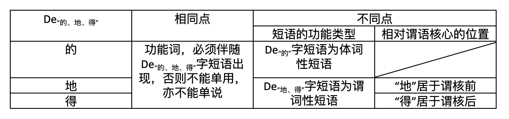

1. **时制助词“的”新议**

“的”字是现代汉语词汇系统中地位十分重要的一个功能词（function word）。通行的现代汉语语法体系认为，功能词“的”有三个，即作为结构助词的“的”，作为语气助词的“的”和作为时制助词的“的”。但我们根据考察认为，时制助词的“的”实际上并不存在，其词类实质应为语气助词的“的”。

一般认为下面两个例子中的“的”为时制助词：

1. 你什么时候来的北京？
2. 我在城里读的高中。

相关的分析认为，在上述两个句子里，“的”有表示事件已发生的意思，因此是时制助词，通常被用于谓语和宾语之间。但在上述语境中，两个句子可以被改写为：

1. 你（是）什么时候来的北京？——你（是）什么时候来北京的？
2. 我（是）在城里读的高中。——我（是）在城里读高中的。

我们在上面两句的主语和状中短语之间加了一个被省略或隐含的“（是）”，是为了说明，在这类“时制助词”所在的句式中，其句中新信息或焦点的位置是在状语上（通常是表示时间和地点的状语），而不是在其后表示事件的动宾结构上。也就是说，上述两个句子句中的事件都是旧信息，因此这些事件都是已发生过的（不然不会成为旧信息），所以句中的“的”都可以被移至句末而整个句子的语义不变。而当“的”被移至句末时，它就纯然是个语气助词，表示确认的语气，同时也标记旧信息（新信息在前）。我们认为这里的“的”在移动前后的过程中，并没有发生词性的变化，所以都是一个语气助词“的”，而不存在所谓的时制助词“的”。

我们还可以把两个句子里头的“的”都删去，得到下面两个新的句子：

1. 你什么时候来北京？
2. 我在城里读高中。

尽管说例（5）一般都可以被改写为“你什么时候会来北京”，表示对尚未发生的事件的询问，但这里的事件之所以是尚未发生，是由整个句子的结构所传递出来的：首先，整个句子是个疑问句，而疑问的焦点则在于事件发生的时间；其次，整个句子的谓语核心只受表示时间的疑问焦点修饰而不受其他成分限定；这种“施事者+什么时候+事件？”结构的句子一般只用于询问尚未发生的事件，如“你什么时候做作业？”“你什么时候去上课？”但在表示肯定语气的语气助词“的”之后，谓语核心受到限制，体现出强烈的旧信息色彩，此时人们一般默认此事件已经发生，而不是尚未发生，整个句子由此变成了对已发生事件具体细节上的询问。这其中可能有很深刻的认知理据，本文不打算讨论。但我们还可以进行简单的比较：在“你在哪里读高中”类的句子里，尽管也是疑问句，但这句话中的事件可以是已发生的，也可以是正在发生的，还可以是未发生的，如：“你之前在哪里读高中？”“你现在在哪里读高中？”“你打算在哪里读高中？”而在这三个问题中，前面两个都可以用例（6）的句子作答，由此可见例（6）句中事件的发生与否，得根据一定的语境才能判断。就算是例（5）的陈述句，如“我九点来北京”，此事件的发生与否也得根据一定的语境才能判断，比较：“我九点来北京，现在人在宾馆”，“我九点来北京，十点住宾馆，然后打算在那里住上几天。”可见，似乎只要不是“施事者+什么时候+事件？”结构的句子，我们通常认为是加“的”标记事件已发生的含有时制助词的句子，在去掉“的”后，并不一定丧失了[+事件已发生]的语义特征。因此，该类句式的“的”并不具有区分“事件发生与否”的语法功能。

另外，这里还有两个有趣的句子值得注意：

1. *我明天九点来的北京。——*我是明天九点来的北京。——*我是明天九点来北京的。——*我明天九点来北京的。
2. *我现在在城里读的高中。——*我是现在在城里读的高中。——*我现在在城里读高中的。——*我现在在城里读高中的。

例（7）例（8）两句由于有“明天”“现在”两个表示非过去时态的词而使整个句子无法在原本“时制助词”的位置上插入“的”，这是为什么呢？我们认为这不是因为时间状语所表的“非过去时态”与所谓的时制助词“的”所表的“事件已发生”二者在语义上发生冲突因而无法搭配，因为事实上这两个句子也无法改写成原式右边的三种变式，由此可知他们与表示确认语气、同时具有标记旧信息的语气助词“的”是不能共现的。正如所谓“时制助词‘的’”的所在句子的状语往往表示时间和地点，可见此类句式中的语气助词“的”的出现环境是有条件限制的，这个限制就是其所在环境必须是[+事件+旧信息]，或者[+已发生事件]。

总之，“你什么时候来的北京”“我在城里读的高中”这类句式的“的”所处的环境（谓词性“的”中短语）本身就包含着“事件已发生”的时态特征，所以“的”在此并不传递任何时态信息。“的”之所以让人产生表示事件已发生的作用，这是因为这里的“的”是“是……的”的省略或隐含结构，“是”作为焦点标记与表示时间或地点的状语相关联，表示句中的焦点或新信息是在时间状语和地点状语上，而“的”作为语气助词，在这里用来表示确认，同时也有标记旧信息的作用。正是由于这里的“的”字所在环境为旧信息所在环境而且表示具体事件，所以一般人误把语气助词“的”混淆为时制助词“的”，根据本文的分析，这其实是不准确的。

（又及：其实背后的认知理据很简单：任何事件都具有时空性，当我们把重点放在对事件所发生的具体时间或具体空间上，我们即已经预设此事件为过去事件，即已发生。）

2. **非典型性“的”字短语的可能性类推**

上述在动宾短语中间插入语气助词“的”的结构引起了我们的注意。很显然，只考虑形式上的特点，这类结构与结构助词“的”所在的定中短语都可以被描写为：X+的+Y。或者说，不考虑词性的差异，这两种结构都可以统称为“的”中短语。另外，这两个结构中“的”后面的句法成分Y在一定语境下经常都可以被省略，如：语气助词“的”：你什么时候来的（北京）？我在城里读的（高中）。结构助词“的”：我的（东西）。吃的（东西）。由此我们假设，“你什么时候来的北京”“我在城里读的高中”这类句式的“的”之所以能插入动宾短语中间，是由于语气助词“的”类推结构助词“的”的“的”中短语的结构特点而从句末被移动至句中。

我们这么说主要有两个原因：一、两类结构都可被描写为“X+的+Y”，而其中，“的”字定中短语无疑是这个结构的典型代表，这就是“的”字定中短语成为“X+的+Y”结构形成的最为主要的“借形”来源。二、如果我们采取类推说，那么不仅许多非典型“的”字定中短语的形成动因也能由此解释得通，而且许多非典型“的”字短语也解释得通。由此可见，类推说具有强大的解释能力。下面分别是非典型“的”字定中短语和非典型“的”字短语的具体用例：

A.非典型“的”字定中短语：

1. 他的老师当得好。——*他的老师（意思大变）。
2. 他的篮球打得好。——*他的篮球（意思大变）。
3. 他的三千米拿了金牌。——*他的三千米。
4. 别扫大家的兴。——*大家的兴。
5. 你走你的阳光道，我走我的独木桥。——*你的阳光道/*我的独木桥。
6. 你去捧你的梁朝伟的周瑜去吧，我还是喜欢我的林青霞的东方不败。——*你的梁朝伟的周瑜，我的林青霞的东方不败。

B.非典型“的”字短语：

1. 他的老师当得好。——他的当得好。（回答“哪个老师当得好？”）
2. 他的篮球打得好。——他的打得好。（回答“谁的篮球打得好？”）
3. 他的三千米拿了金牌。——他的拿了金牌。（回答“谁的三千米了金牌？”）
4. 你念你的书，我睡我的觉。——你念你的，我睡我的。——*我的觉。
5. 去你的！
6. 这个会，你的（是）主席，他的（是）秘书。

非典型“的”字定中短语和非典型“的”字短语无疑是典型“的”字定中短语和典型“的”字短语通过借形类推而得，但无论是非典型“的”字定中短语还是非典型“的”字短语，它们的共同特点是口语色彩和语用色彩浓厚，通常在一定语境下才能成话，极少用于书面语，这与语气助词的“的”中短语是一致的（如：*来的北京。*读的高中。），而与典型的结构助词“的”的用法不同。另外，这三个类型的“的”中短语都没办法单说、成话，或者单说意思大变。也就是说，它们对于句子的依赖性很强，这与典型的“的”中短语（“的”字定中短语和“的”字短语）能直接存在于短语层面是很不相同的。不过，所有的“的”中短语都有一个共同点，就是在语义上，“的”字前后的句法成分基本上是直接相关的。如：“你什么时候来的北京”，“来”的目的地是“北京”；“我在城里读的高中”，“读”书的层次是“高中”；“他的老师当得好”，“他”和“老师”是同一个人，“老师”是“他”的身份；“他的篮球打得好”，“他”是“（打）篮球”的施事者；“别扫大家的兴”，“兴（致）”为大家所有；“你走你的阳光道”，“阳光道”是“我”走的地点。类似的分析可以同理应用于“的”字定中短语，此处不再赘述。

我们主张类推，也可以从非典型“的”字定中短语和非典型“的”字短语的对应关系中看出，这种对应关系无疑与“的”字定中短语和“的”字短语是类似的：后者在一定语境中可以是前者的省略现象的产结果，比如例（15）—例（18）所示。特别是例（15）—例（17）三例，都只能是回答特定的问题中才能出现，可见当话说者在用右式回答问题时，心里面是将左式的非典型“的”字定中状语当作一般性的“的”字定中短语使用。而例（19）和例（20）则表明，不是所有的非典型“的”字短语可以通过省略非典型“的”字定中状语的中心语成分得来，这就使得它自身的存在具有独立性。如果根据“的”中短语的功能类型，我们会发现，非典型“的”字短语与语气助词的“的”中短语都是谓词性的，而其他所有类型的“的”中短语统统都是体词性的。这有两个方面的含义：一、既然“的”字短语可用为谓词性短语，这就为语气助词的“的”中短语用作谓语提供了旁例。二、既然其他所有的“的”中短语都是体词性的（就算是“这本书的出版”“春天的到来”这类句子，也仍是体词性的），那么这也就意味着，语气助词“的”与结构助词“的”是有着鲜明区别的两个词，而不是一个词。语气助词的“的”中短语与一般的“的”中短语的关系只是纯粹形式上的借形与移植。

语气助词“的”之所以能类推结构助词“的”的“的”中短语的结构特点而从句末被移动至句中，我们认为可能的解释是：两个词在语音形式上的一致性与“的”字短语的极高使用频率（一般用作“的”字定中短语），是这种类推得以实现的外在因素。至于内在因素，或许是语气助词的“的”中短语使用起来更方便、心理上更省力（由于人们用习惯了“的”字定中短语），所以使用上的便利性可能是这种类推得以最后实现的心理动因。不过这些都有待进一步的详细考证。

3. **“的、地、得”与词类划分**

“的”字内部的词性分化，使我们想起了语音形式一致的“的、地、得”，可以暂时统称为De“的、地、得”。

“的、地、得”三个词都是现代汉语词汇体系的高频词，使用频率极高，因而也都是功能词。这三个词构成了现代汉语词类分类系统中助词的一个小类，即结构助词。就理想关系而言，这三个词之间的关系为：

由表可知：

首先，“的、地、得”无一例外，都是功能词，或者说，都是虚词，它们必须在De“的、地、得”字短语中才能被使用，所以它们的全部语法功能便在于参与构造De“的、地、得”字短语，其语法意义必须放在De“的、地、得”字短语中才能显现。就这个角度而言，De“的、地、得”可以被整体视为一个功能词。

其次，De“的、地、得”内部的三个词性变体可以通过两个步骤切分出来：第一步，如果De“的、地、得”字短语的功能类型为体词性，便可从De“的、地、得”中切分出“的”；如果De“的、地、得”字短语的功能类型为谓词性，而De“地、得”的位置又在谓语核心之前，则可从中切分出“地”，否则则切分出“得”。

众所周知，“的、地、得”在书面上的不同是人为规定的，而规定的依据也正在于上表它们之间所显示的关系。但在实际使用上，这三个词经常是被混用的，通常的情形为：“地、得”被写作“的”，而不是相反，这也可以从现代汉语词语使用频率表中“的”字的使用频率远远高于“地、得”的总和看出（见第四节）。我们认为有三个原因：

1. 在实际的口语交流中，“的、地、得”的语音形式是一致的，而这并不妨碍人们正常的交流。因此，就算在书面语上混用“的、地、得”，通常情况下并不会造成理解上的困难，人们完全可以根据日常的使用去推测混用的De“的、地、得”在书面语中本应被写作的形态，或者也不用推测，像口头交际那样直接理解。
2. 人们在切分语音形式一致的De“的、地、得”，前后所使用的切分依据是不一样的，也就是并不严格遵守语法单位切分的同一性原则（identification）。根据上表的关系可知，“的”与“地、得”区分开的依据是它们在不同功能类型短语中的分布，“地”与“得”区分开的依据是它们在De“地、得”字短语中相对谓语核心的分布。可见“的”与“地、得”前后的区分依据不仅不一样，甚至还不处在同一层级的语法环境中，“的”的切分处在更高一层的语法环境中。这就使“的”一方面比“地、得”具有更为广泛的组合能力，另一方面也使得这三个词在分布上互补，为三个词混用而不造成理解障碍提供了条件。
3. 这三个词的混用以及“的”字占优，也是有历史原因的。这里以De“的、地、得”的历史演化简单论述如下：

De“的、地、得”最早出现的时间大约为公元9世纪，在唐宋时期一般被写作“底”，也有“地”的用例。“底”主要用在定中结构，也可以用在状中结构，而“地”则一开始似乎只是 “蓦地”“忽地”“特地”“暗地”这些词的语尾词缀，后来语法化成状中结构的语法标记，但用例还不是甚广，甚至还不如“底”。“底”在元明时期被“的”取代，并且越用越广，《水浒传》基本上只用“的”，个别地方还用“地”。到了清代，“的”就一统天下，《红楼梦》《儒林外史》就全部用“的”。民国时期，特别是白话文运动推广之后，受欧化语法特别是英语语法影响，不少语言文字工作者主张De“的、地、得”在书面上的分化，如以“底”来标记领属关系，“的”来标记此外的定中关系，“地”来标记状中关系等等，但基本上，这些De“的、地、得”仍是被随意混用的。新中国成立后，随着1956年《暂拟汉语教学语法系统》的颁布，“的、地、得”的区分在教学界和出版界开始被逐渐严格地贯彻，它们分工明确，依次作定语、状语和补语的语法标记。尽管如此，由于上述的原因，“的、地、得”混用的现象仍时有发生，至今不绝。

鉴于De“的、地、得”在语音上相同、分布上互补、历史上相关，以及在口语中不混淆但在书面语中常混淆这些事实，不少人开始主张统一书面语的De“的、地、得”为“的”，或者统一“的、地”为“的”，保留“的”和“得”的区分。后一种观点认为，在“这两个花瓶小得有意思”和“这两个花瓶小的有意思（大的不怎么样）”类似的句子中，保留“的、得”书面的差别更有利于理解和表达。不过，这些主张也至今未被采纳。

“的、地、得”在书面形态上的区分，反映了人们对De“的、地、得”词性复杂性的意识。换句话说，人们意识到（也可能是集体无意识），在现代汉语中，语音形式相同的De“的、地、得”，其词性内部是复杂的、异质的，至少可以分为三类，即De“的”、De“地”、De“得”，或“的、地、得”，所以有意识地在书面上加以区分。但这三个词的混淆现象与其说反映了特定的De“的、地、得”变体在使用上的复杂情况，毋宁说反映了人们在口语和书面语对应和转换上所存在的认知困境：一方面，人们能意识到语言系统中各个成分或某个成分内部的差异（语音上、意义上、功能上……），并由此发展出了相应的书面语和语言分析理论；但另一方面，人们对这种差异的认识在逻辑上又是不严格、不完全、不彻底的，这也同时表现在相应书面语和语言分析理论的不完美处，比如De“的、地、得”在词类上的划分并未严格遵守语法单位切分的同一性原则，这与整个现代汉语词类系统的划分现状是一致的。人的认知存在这种逻辑上的二重性，自然语言也存在这种逻辑上的二重性，这二者应该是可以互相对应起来的。

或许，De“的、地、得”词性的复杂性真的不过是现代汉语整个语言系统（词汇系统、语法系统……）复杂性的一个小侧面。

4. **小结**

不考虑书面形态上的差异，De“的、地、得”很可能现代汉语词汇系统中词性最为复杂的单词。词性的复杂性与单词使用的频繁性密切相关。据线上“现代汉语语料库词语频率表”的统计（语料库规模：2000万字），“的、地、得”三个词在现代汉语中的出现频率（frequency）分别为7.7946%、0.443%、0.1957%，在“频率表”中的排名分别为第1、14、46。具体的统计数据，各家或许稍有出入，但“的”字总是现代汉语第一高频词、“地、得”也总是依次排名稍后，居高频词列表前列。总之，De“的、地、得”无疑是现代汉语使用最频繁的单词（8.43333%），远非其它单词所能企及（“的”外的前11高频词的使用频率总和为8.4225%，还略低于De“的、地、得”）。这种使用的频繁性，使De“的、地、得”负载了大量的使用功能，即“用法”（usage），一定程度上解释了De“的、地、得”在词性上的复杂性。而且，从“的”的词性远比“地、得”的复杂这个事实来看，我们认为，在一定程度上单词的使用频率高低不仅可以解释其词性复杂程度的成因，也解释单词词类形成的原因，比如由于高使用频率，“的、地、得”均为功能词。语言是被使用的，词类划分的根本依据，也必须是实际使用的自然语言，因此，自然语言的复杂性，也正是产生于使用之中。De“的、地、得”或“的”在词性上的复杂性及其内部分化的不对等性，或许不过是现代汉语语言系统复杂、异质的缩影。又或许，人们还没发展出一套相应完满的应对方案。

“的”字（语音形式一致）在内部词性分化上的复杂性，及“的”字本身极高的使用频率，使得内部类推成为可能。这种类推有结构上功能上的综合类推，如非典型“的”字定中短语和非典型“的”字短语对典型的”字定中短语和典型“的”字短语的类推；这种类推也可能只是结构上的借形类推，如语气助词的“的”中短语对一般“的”中短语的类推。这种类推的说法具有很强的解释能力，但这种类推背后的认知机制，仍有待研究。

本文还详细论证了所谓时制助词“的”的词类实质，即表示确认、同时具有标记旧信息的语气助词“的”。我们还解释道，这里的语气助词“的”之所以会被认为是表示事件已发生的时制助词，是由于此类句式中的语气助词“的”的出现环境是有条件限制的，这个限制就是其所在环境必须是[+事件+旧信息]，或者[+已发生、已完成事件]。这就意味着，“的”字研究应具体问题具体分析，需要详细的考察，而不能仅凭语感。

已故语言学家朱德熙先生，“四十余载治语法，为‘的’消得人憔悴”，并在此研究过程中，开创性地使用或者提出了不少现代汉语语法研究的重要方法和概念，成果丰硕，其学生袁毓林评价认为“一个小小的‘的’字，牵动着汉语语法的全局，”可谓中肯。但“的”字的研究仍然任重道远。本文抛砖引玉，希望能有所收效！
